# A2 – Truss Stress Analysis

## Note to Reader

Any hand drawn work in this assignment includes standardized highlighting colors:

- **Yellow** highlight signifies the header of a new portion of work (ie: solving for forces, List of Numerical Forces, etc.)

- **Blue** highlight signifies the answer to a question that was being solved under a yellow header (ie: By=-6.66 KN under the yellow header of solving for external forces)

- **Green** highlight signifies commentary, which will also be written as text within this assignment

## Objective

-Design a lightweight planar truss using A500 steel or an alternative material.

-Create free body diagrams (FBDs) for joints and critical pins.

-Calculate the required cross-sectional area of truss elements with a safety factor.

-Determine pin sizes based on shear forces with a safety factor.

-Solve equations symbolically and numerically for both truss and pin design.

-Estimate the total weight of the truss and pins.

-Create a CAD model with accurate dimensions and connections.

-Compare CAD weight predictions with hand calculations.

-Document key engineering lessons learned from the process.

## Analyze

# My Process

For Assignment A2 I was tasked with creating a planar truss that fit within given parameters. 

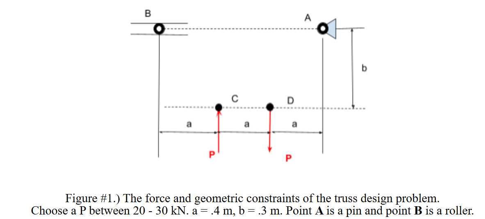

This was the layout given to design a truss to support:

- **Point A** is a pin support

- **Point B** is a horizontal roller support

- **Point C**  is where the first P force is located

- **Point D** is where the second P force is located

## 2. Designing Truss Structure

**a. Design the truss structure using parameters in Figure #1**

**i. Sketch a truss structure by generating the lengths of each element based to support the loads at point C and D.**

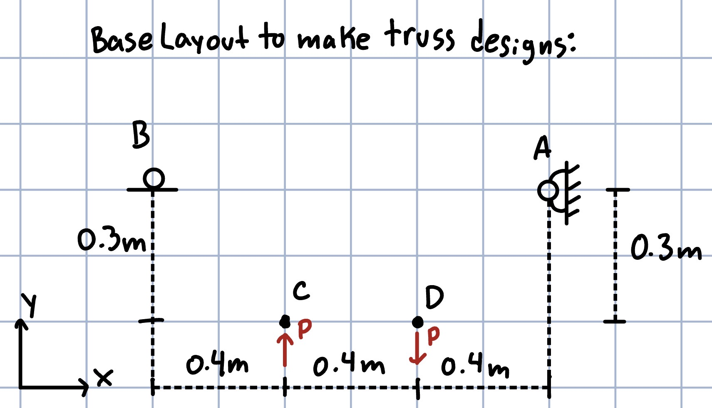

I started by making a basic layout to standardize each of my following designs. This would make it easier to compare the designs and make an informed decision on which one would work best for the presented problem. 

## Preliminary Designs

I came up with 3 different designs that could work as a viable solution to supporting both forces and points C and D

Design 1:

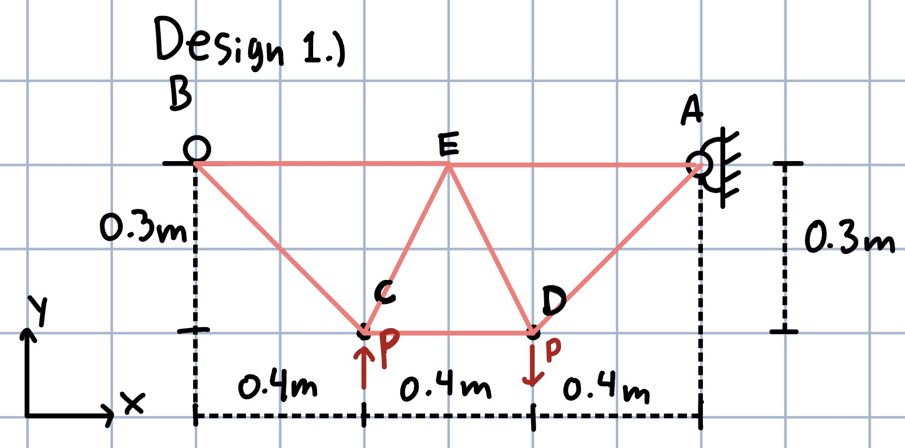

This is a simple underbody truss that directly connects point B to point C, connects point A to point D, connects C and D, and makes a new point "E" that all points meet at in the middle. 

Design 2:

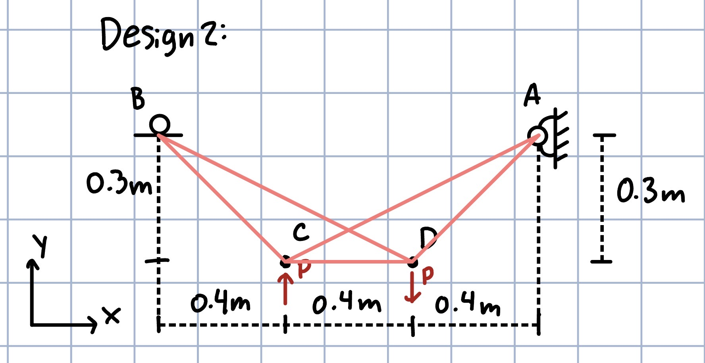

This design Prioritized supporting both loads at points C and D from both anchor points A and B. A support connects both C and D to point B, as well as two supports connecting both loads to point A. One additional member connects the Loads together to make the structure stable.

Design 3:

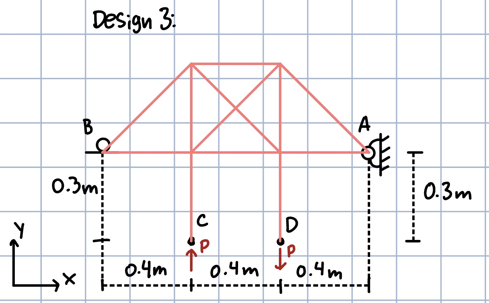

This design utilized the fact that both P forces are perfectly vertical, so both forces would be transmitted directly through their member to a strong truss assembly above points A and B. 

## Picking a Design

Overall Design 1 made the most sense to use because it was the most simple of the 3, and would most likely have the best dispersion of both forces through all of the members, so it was the one I continued the engineering process with going forward. Both design 2 and 3 would pose problems with individual members of the truss taking on too much of the overall load P from both point C and D. Design 1 also will give the best strength to weight ratio since it will be far lighter than design 3 and have overall shorter members than design 2. 

## ii. Design 1 Freebody Diagram

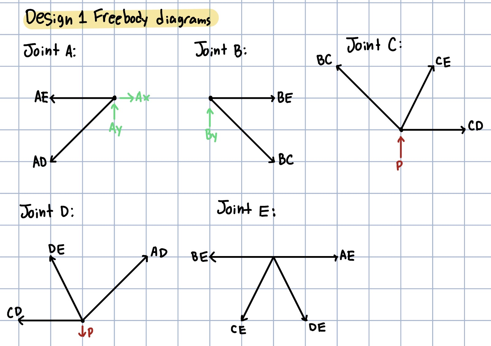

This is the freebody diagram of the design I chose to move on with. It include a separate diagram for each join A through E, including external forces where necessary. These forces include support forces on joints A and B, and load forces P on joints C and D. 

## iii. Symbolically solve for all internal forces

### External Forces:

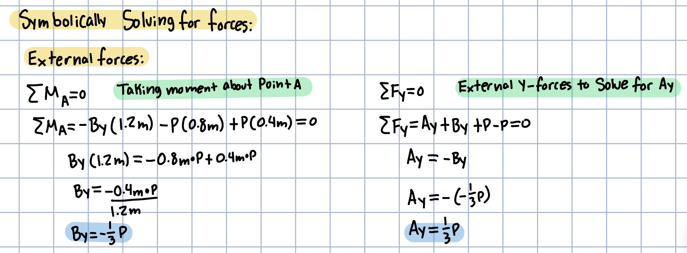

These are solving for the external (support) forces of my truss solved symbolically. 

By=- $\frac{1}{3}$ P

Ay=1/3 P

### Internal Forces:

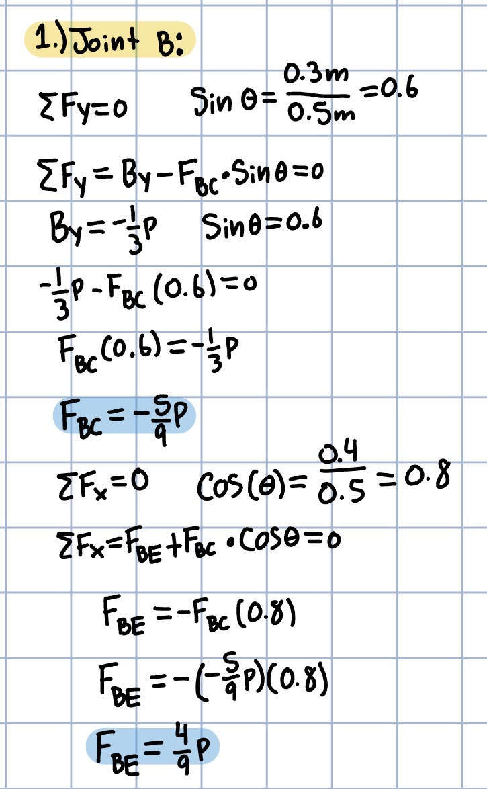

From joint B we find:

FBC=- $\frac{1}{3}$ P

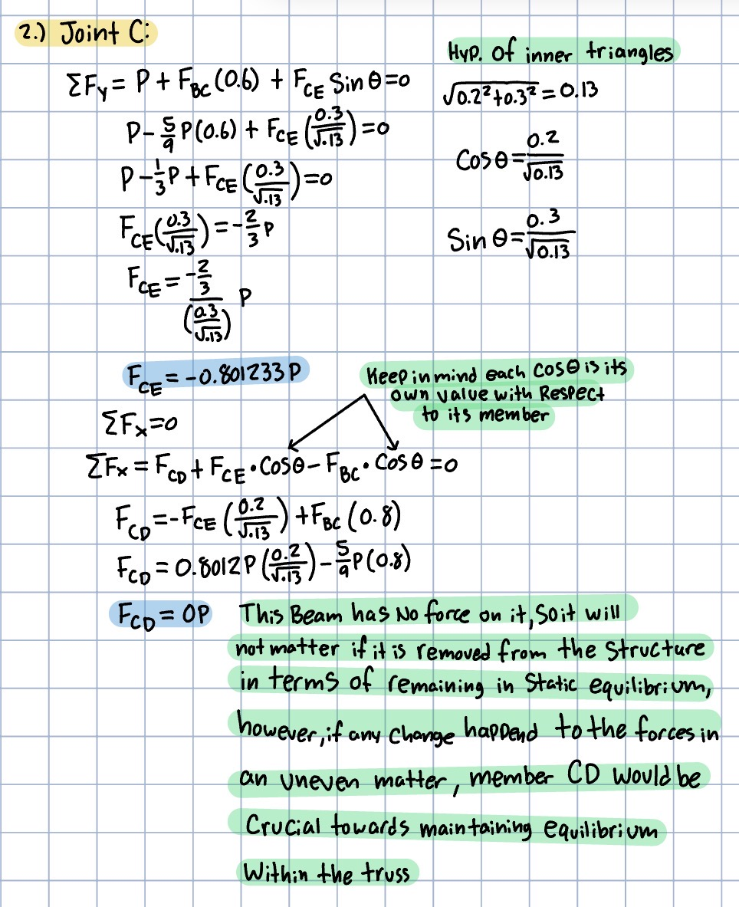

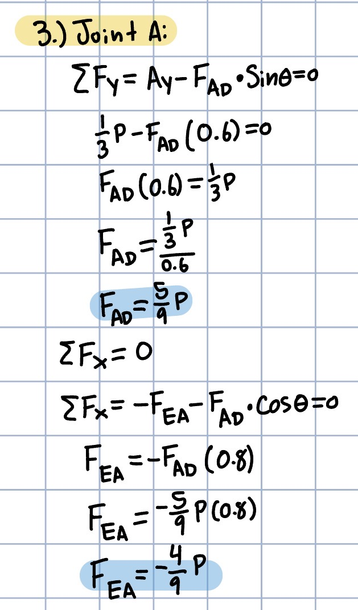

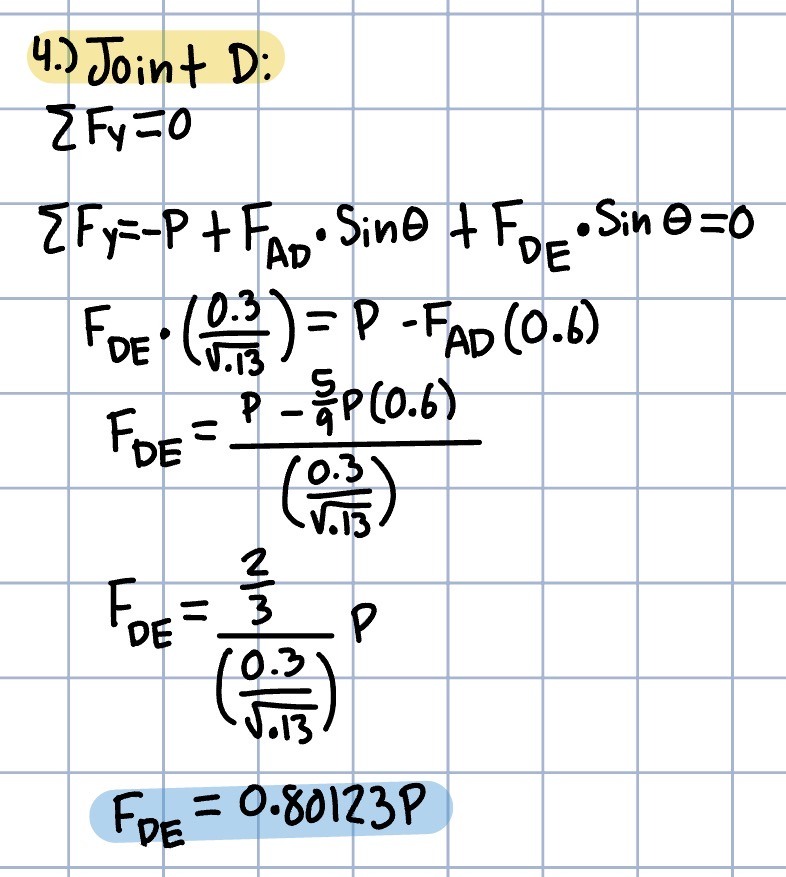

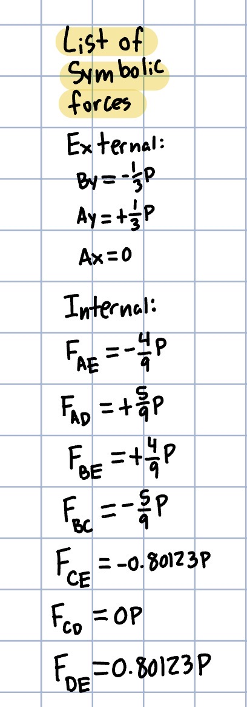

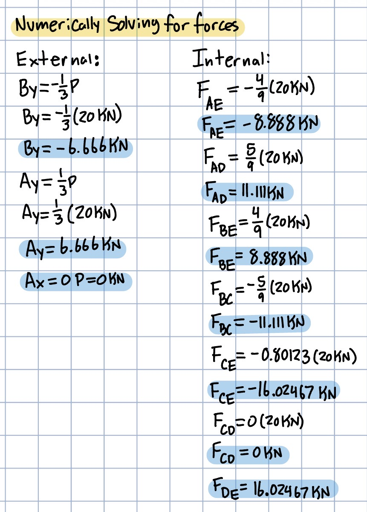

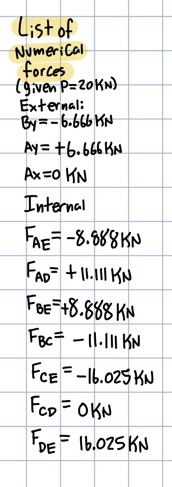

## Decide
_Which geometry did you select, and why? This is your first open design choice in the course — defend it._

## Communicate

