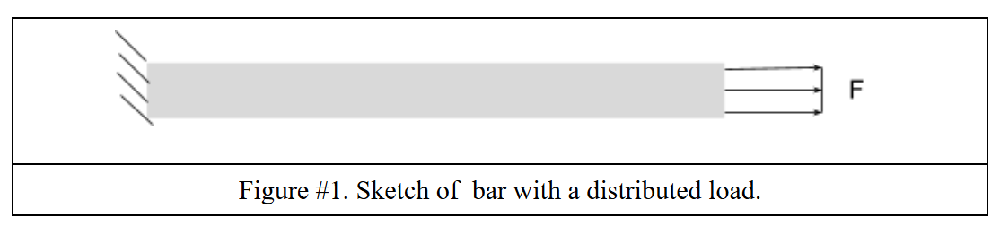
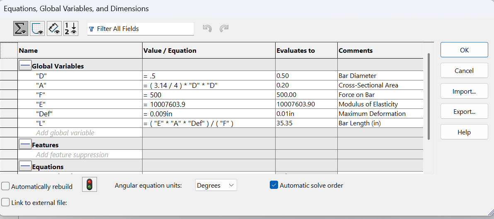
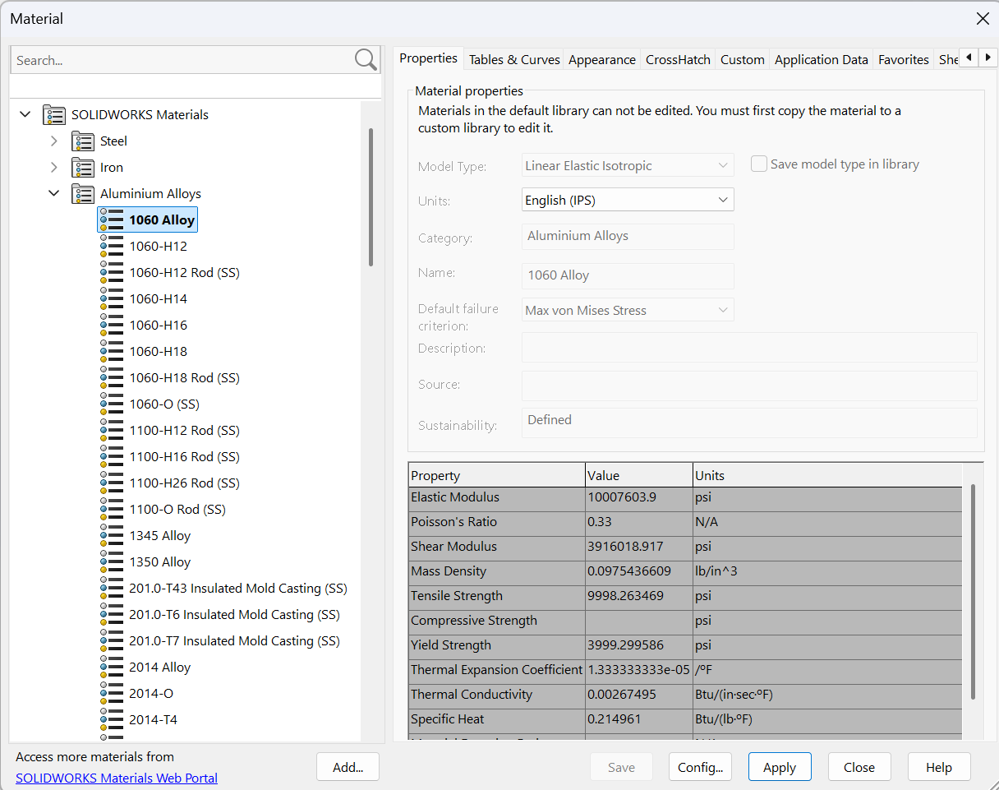

# A3 – Parametric and FEA

## Objective

- Use axial deflection modeling to design its dimensions
- Use parametric design to determine a bars length
- Introduce you to FEA (Finite Element Analysis)
- Introduce you to linking dimensions to appropriate parameters in CAD.
- Compare and contrast the different analysis

## Analyze

### Given Criteria

We are tasked with making a member given the photo above as a reference, as well as the following criteria:

- Must be designed Parametrically
- An applied direct load of $300lb_{f}<F<500lb_{f}$
- Made from Aluminum with a Young's Modulus of $(8.5-11.5)*10^6 psi$
- Max axial deflection of $0.009in.$
- Must have a circular cross-section

### Determining Bar Length

The equations above make variables within Solidworks to parametrically solve for the length of the bar. 

The variables defined include:

- D = Bar Diameter
- A = Cross-Sectional Area
- F = Force on Bar
- E = Modulus of Elasticity
- Def = Max Allowed Deformation
- L = Length of Bar

#### Diameter and Cross-Sectional Area

The diameter was a variable that I could choose the input of, so I chose:

$D=0.5in.$

Using the diameter, we can find the cross sectional area, which gives us:

$A=

#### Material Used

I chose to use 1060 Alloy under the Aluminum Alloys tab of Solidworks material library

As shown in the photo above we find that:

$E=10007603.9psi$

This value falls into the range given at the beginning of the assignment. 

## Decide

## Communicate

