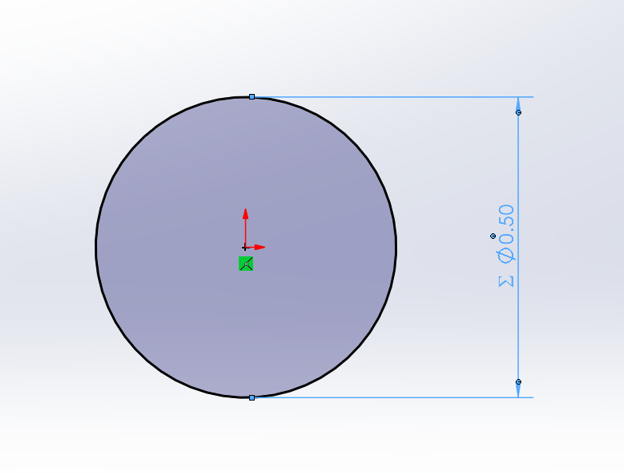
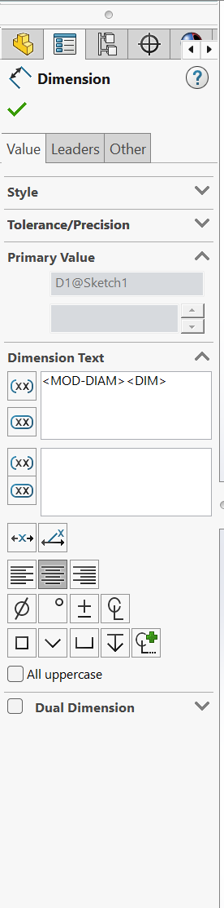
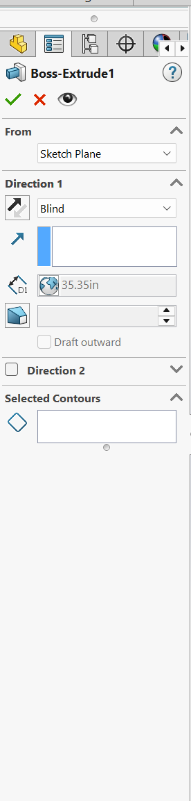
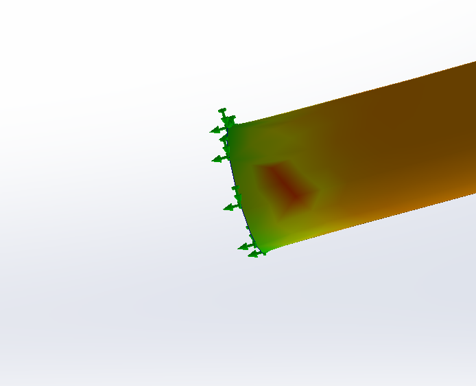
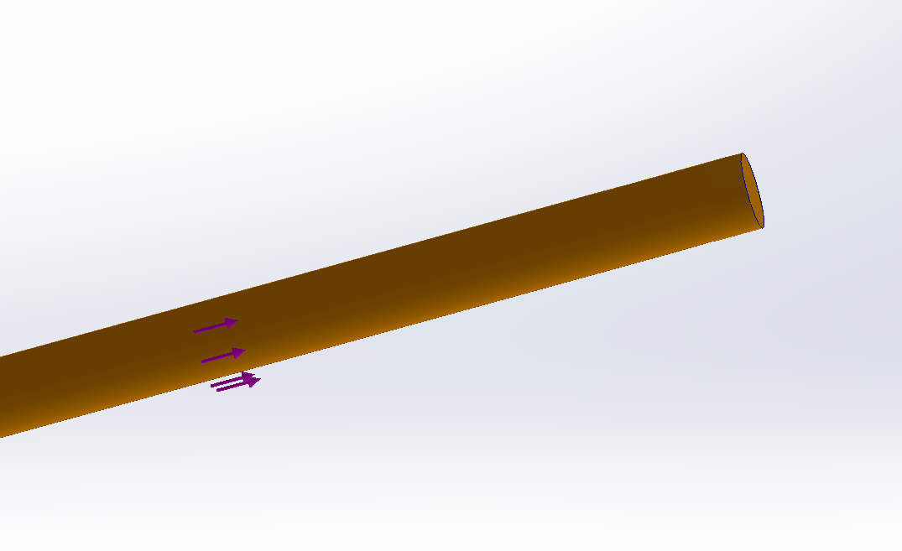
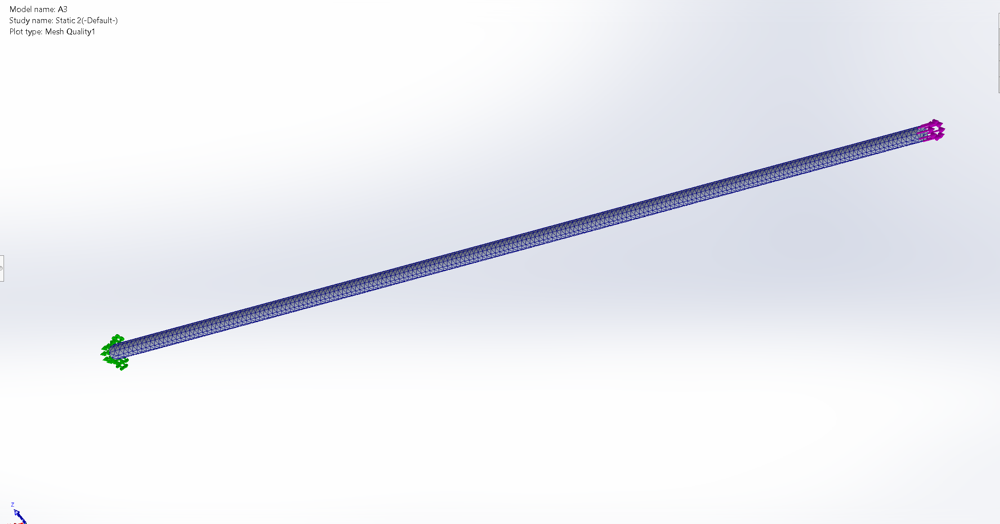
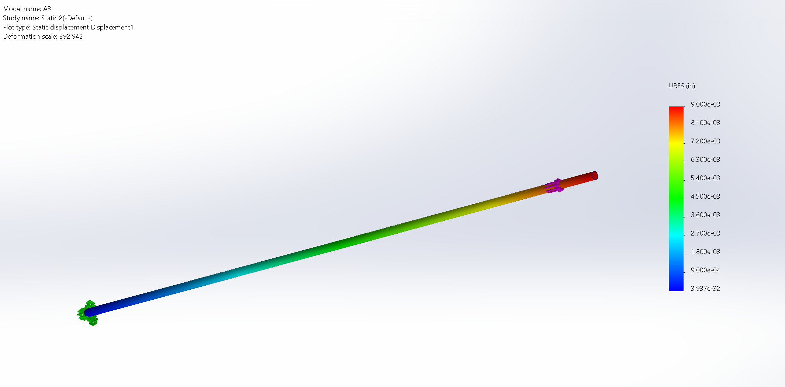
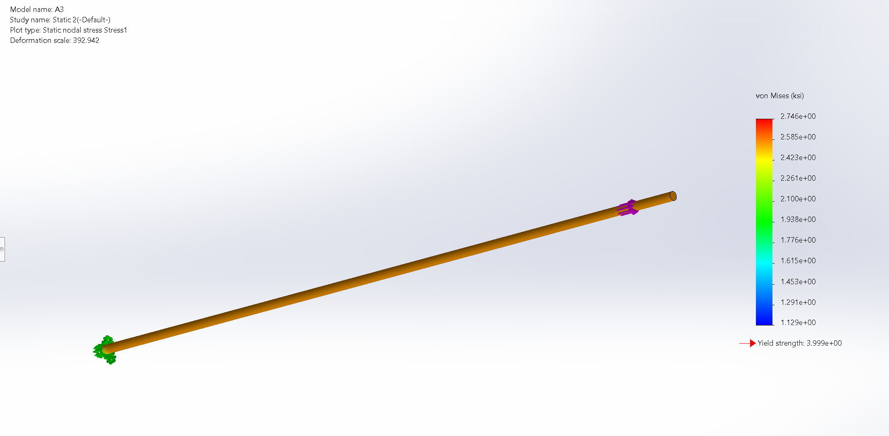

# A3 – Parametric and FEA

## Objective

- Use axial deflection modeling to design its dimensions
- Use parametric design to determine a bars length
- Introduce you to FEA (Finite Element Analysis)
- Introduce you to linking dimensions to appropriate parameters in CAD.
- Compare and contrast the different analysis

## Analyze

### Given Criteria

We are tasked with making a member given the photo above as a reference, as well as the following criteria:

- Must be designed Parametrically
- An applied direct load of $300lb_{f}<F<500lb_{f}$
- Made from Aluminum with a Young's Modulus of $(8.5-11.5)*10^6 psi$
- Max axial deflection of $0.009in.$
- Must have a circular cross-section

### Determining Bar Length

The equations above make variables within Solidworks to parametrically solve for the length of the bar. 

The variables defined include:

- D = Bar Diameter
- A = Cross-Sectional Area
- F = Force on Bar
- E = Modulus of Elasticity
- Def = Max Allowed Deformation
- L = Length of Bar

#### Diameter and Cross-Sectional Area

The diameter was a variable that I could choose the input of, so I chose:

$D=0.5in.$

Using the diameter, we can find the cross sectional area, which gives us:

$A=(\frac{3.14}{4})*D^2$

#### Material Used

I chose to use 1060 Alloy under the Aluminum Alloys tab of Solidworks material library

As shown in the photo above we find that:

$E=10007603.9psi$

This value falls into the range given at the beginning of the assignment. 

#### Bar Length Parametrically

Using the Variables we defined and the ones given to us as criteria, we can make an equation that solves for the bar length parametrically:

$L=\frac{(E)(A)(Def)}{F}$

Plugging in variables finally gives us:

$L=35.35in.$

#### Sketching Cross-Section with defined Variables

After finding all of these variables and Defining them in Solidworks, creation of the beam can begin.

This is the circle that will become the cross section of our beam

This shows the Dimensions for the Circle in the previous photos, and that the diameter has a direct link to our diameter variable. This means that If a change is made to the variable "D" in our list of equations, this sketch dimension will automatically update to reflect the changes made. 

#### Extruding Cross-Section with Length Variable

Once the sketch is made it can be extruded.

This photo shows the dimensions used for the extrude. This directly pull the variable "L" for our length and uses its value. This means that The value will also update if any of the variables used to calculate it are changed. 

### Conducting the FEA

From here the beam is complete and is ready to run an FEA with the given criteria above. I chose to use a force of $F=500lb_{f}$

First the fixed points are defined on one end of the bar as shown in the photo above

Next the chosen force is applied to the opposite end of where is fixed points were made.

After this a mesh is made for the FEA to be applied to, and then the FEA is ran. 

### Results of the FEA

From the FEA we find that:

Max Deflection on the bar is:

$Def=0.009in.$

Max Stress on the bar is:

$Stress_{max}=2.746ksi$

And the Yield Strength is:

$S_y=3.999ksi$

#### Safety Factor

Given the max stress the bar experiences and the given yield strength of aluminum $(40ksi)$. we can find the safety factor to be:

$SF=\frac{40ksi}{2.746ksi}$

$SF=14.566$

### Design Reflection

## Decide

## Communicate

