# A5 – [Topic]

## Objective

These are the objectives listed under this assignments Canvas Page:

- Conduct stress analysis to determine appropriate dimensions for structural features.
- Generate free body diagrams (FBDs) to visualize forces and constraints for each feature.
- Identify and document known and unknown variables, assumptions, and algebraic models for stress calculations.
- Perform stiffness analysis to establish minimum required dimensions based on deflection constraints.
- Compare stress and stiffness analyses to ensure structural integrity and compliance with given constraints.
- Create detailed Multiview sketches illustrating dimensions derived from both stress and stiffness analyses.
- Reflect on and document key engineering lessons learned throughout the process.

## Analyze

### Stress Based Dimension Calculations:

#### Part A: Stress

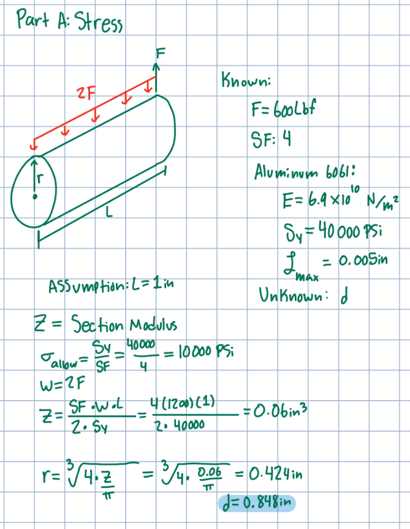

#### Part B: Stress

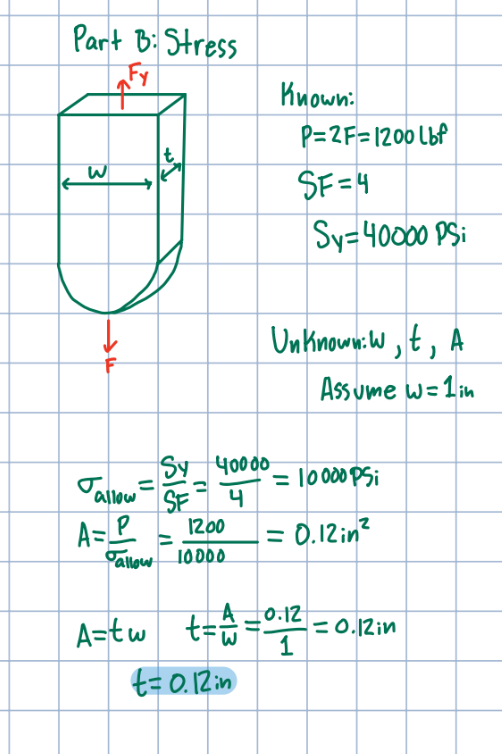

#### Part C: Stress

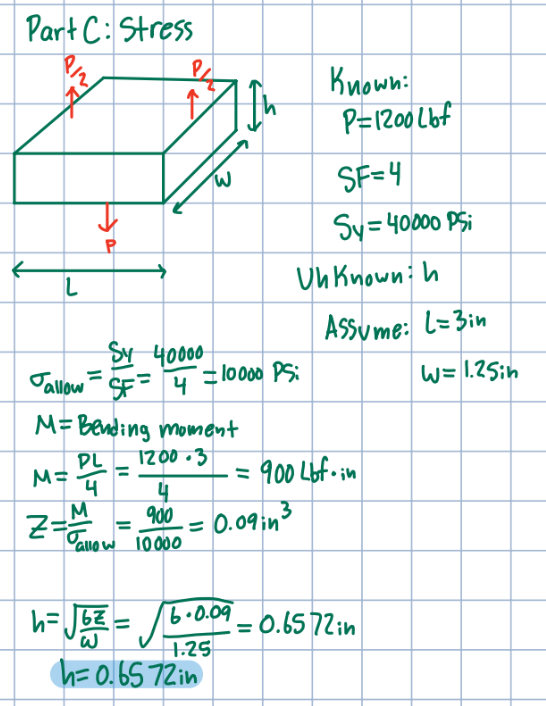

#### Part D: Stress

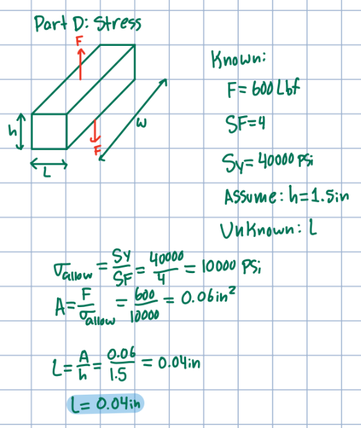

#### Part E: Stress

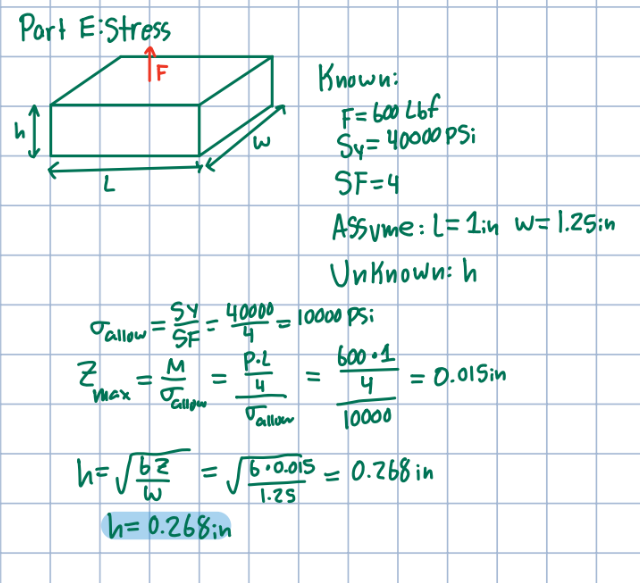

### Stiffness Based Dimension Calculation:

#### Part A: Stiffness

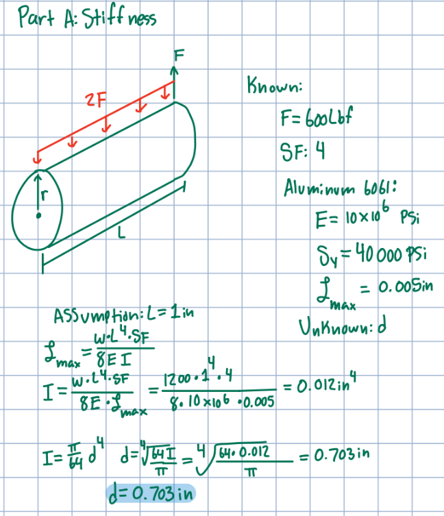

#### Part B: Stiffness

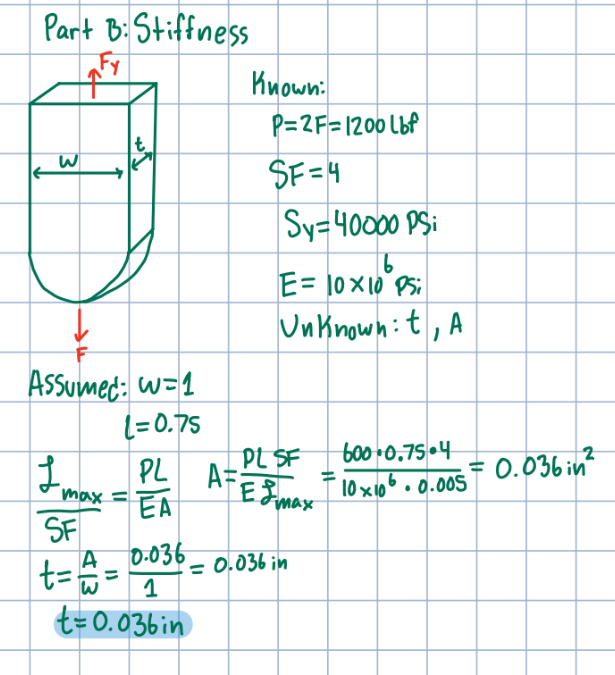

#### Part C: Stiffness

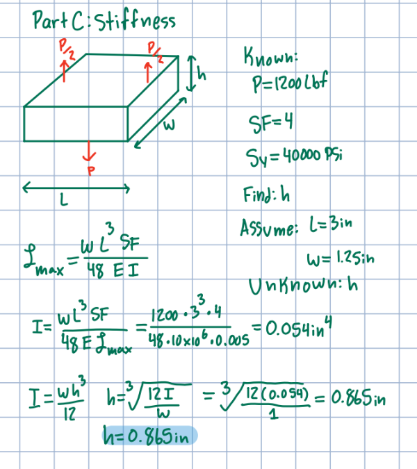

#### Part D: Stiffness

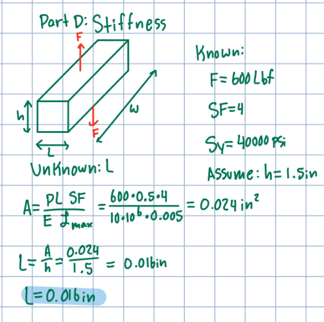

#### Part E: Stiffness

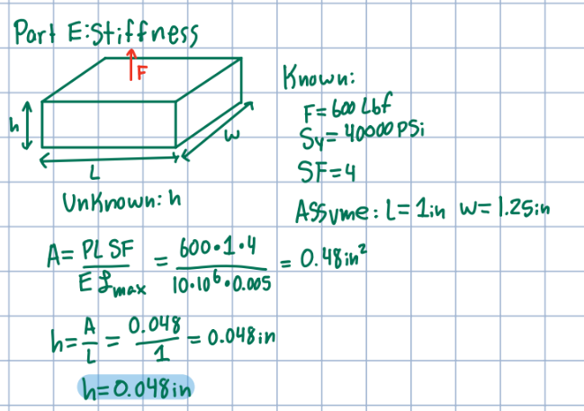

### Final Dimensions

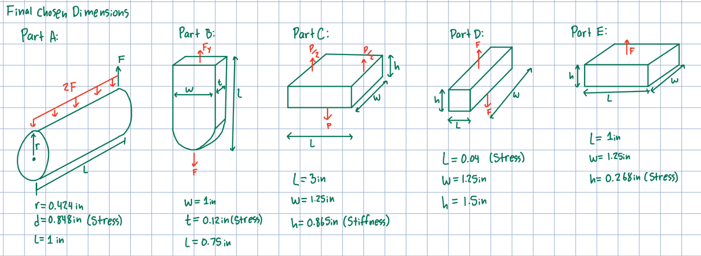

### Multiview Sketches:

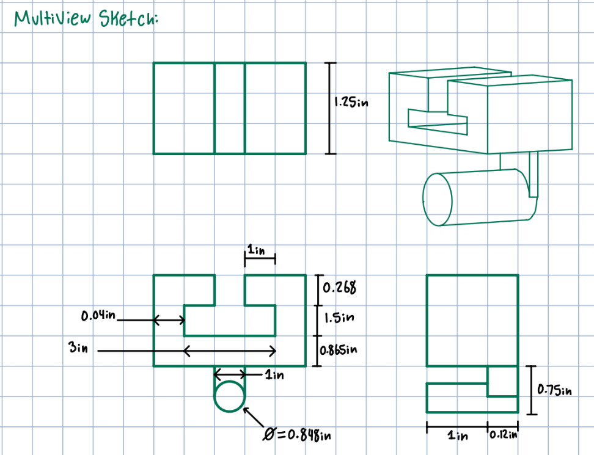

### Lessons Learned:

#### Governing Failure Mode:

For Part A (Rod holding the strap). The governing dimension I chose was $d=0.848in$ which was derived from the stress calculations. I chose this one because it was the larger of the two dimensions when comparing the one derived from stress and the one from stiffness. Taking the larger of the two to be the final dimension means it will perfectly suit the constraint it was derived from (stress in this case) and be larger than the measurement needed for the other constraint. (stiffness in this case) The difference between the two was:

$d_{stress}-d_{stiffness}=0.848in-0.703in=0.145in$

#### Error Propagation 

One error I made was originally not making the assumed dimensions of parts D and E be able to fit onto the T shaped bracket at the top. If the change was not made to fix this the bracket would not even mount onto the T shape at the top, thus, making the part fail. This error was only caught once making the final Multiview sketch and writing down the dimensions onto the sketch. But thankfully, the dimensions were easy enough to go back and change since they were only part of the final calculation of each member. 

#### Assumption Sensitivity

If sheer negligibility was not something intentionally left out when calculating the dimensions of this bracket, It would have its own set of equations for each member to ensure the minimum dimensions were met to keep sheering from happening to the part. Just like stress and stiffness had their own FBD, and respective equations, sheer would have a similar setup that could cause some of the dimensions to be larger. 

## Decide

### Time spent

I spent around 5 hours on this assignment

## Communicate

