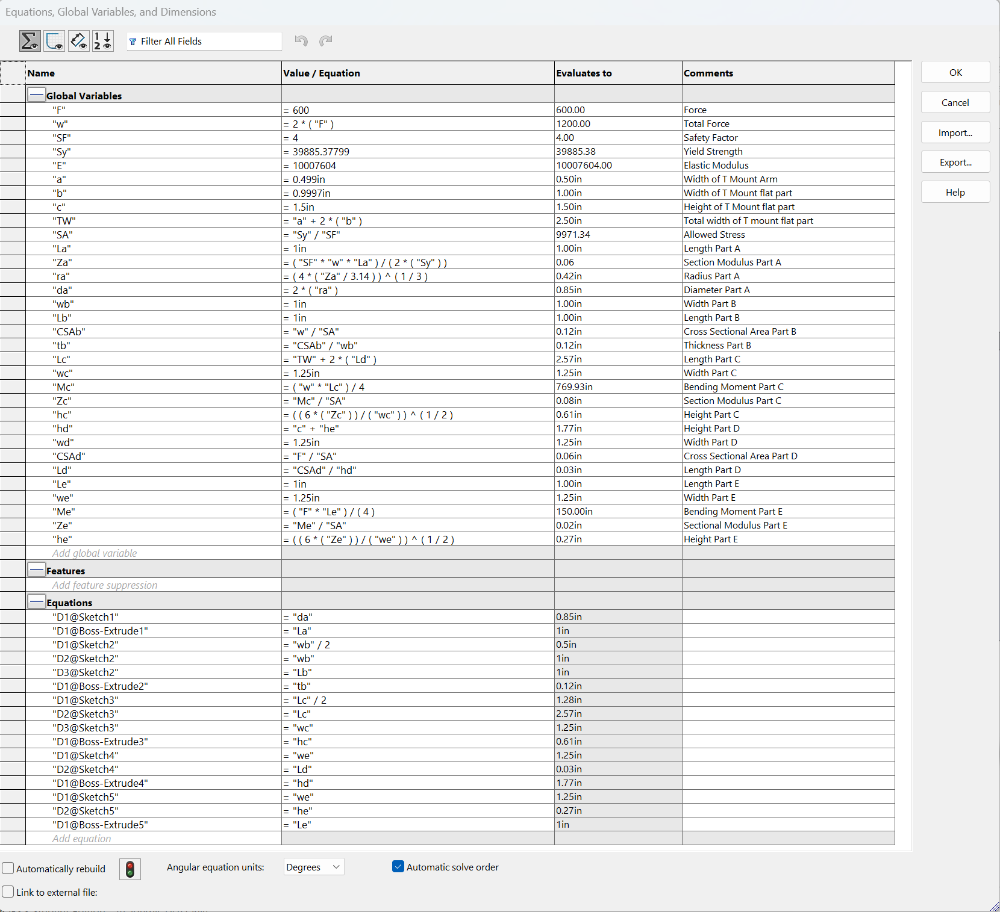
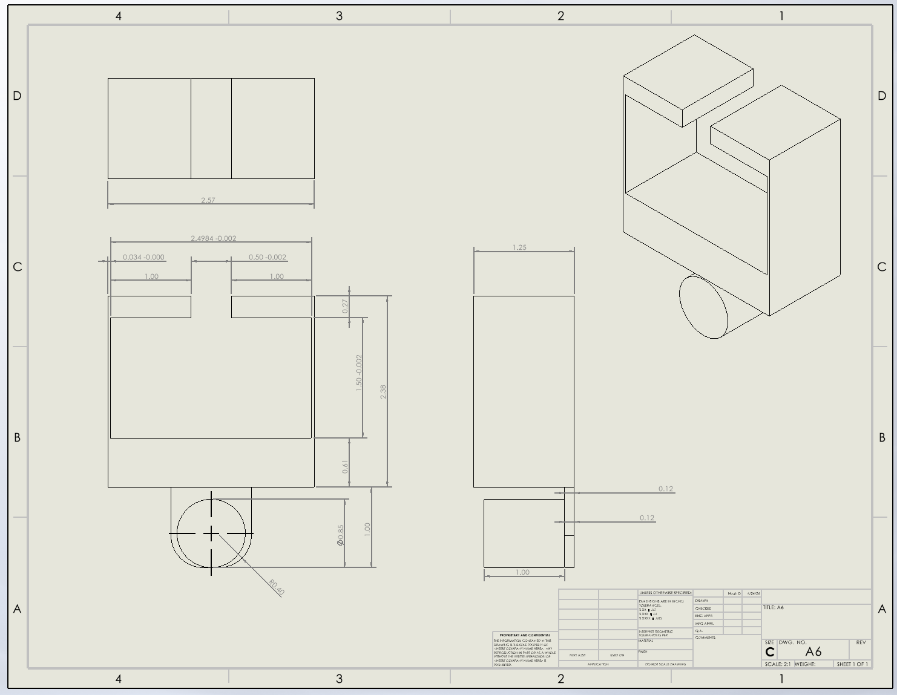
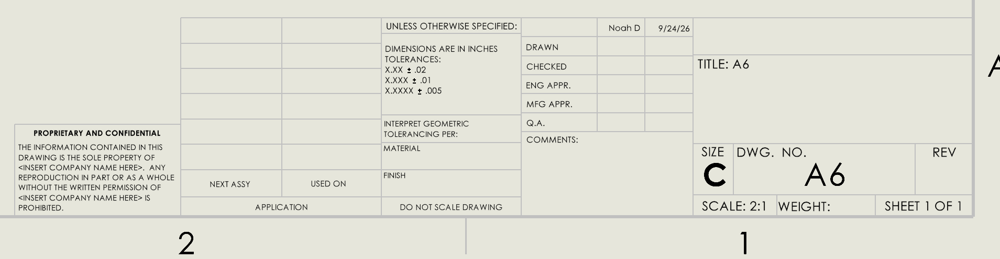
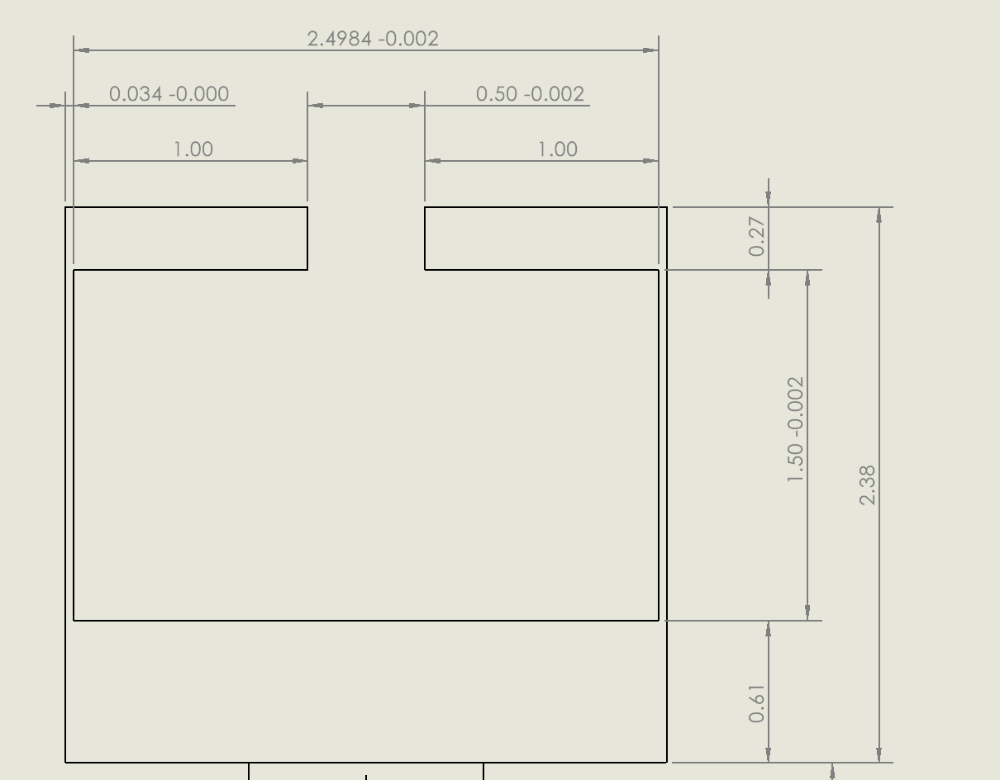

# A6 – [Topic]
## CAD File and Drawing File Downloads:
<a href="A6.SLDPRT" download>Download Solidworks Model (SLDPRT)</a>

<a href="A6.SLDDRW" download>Download Solidworks Drawing (SLDDRW)</a>

## Objective
### Parametric Equations

### Images of Applying parametric equations to each part:

#### Part A

#### Part B

#### Part C

#### Part D

#### Part E

### Multiview Drawing in CAD

#### Tolerances for T Mount clearance

## Analyze

### Reflection

#### 3.a.

For Part A I chose to use the stress equations because they output a larger value, meaning that the minimum diameter needed for max deflection would be met and the stress minimum diameter would be met as well. This dimension was found using the equation $Diameter= 2[( 4 * ( "Section Modulus" / 3.14 ) ) ^{1 / 3}]$. This equation did require changing the force to correctly reflect the right amount because it was originally only using $F=600lbf$ rather than $w=2F=1200lbf$. This updated the model as needed without any extra adjusting needed. 

#### 3.b.

I chose to add a tighter tolerance to 0.500 opening that allows the T mount to slide into the bracket because if this tolerance was set to the normal $+-0.02in$, the lower bound of this tolerance would be too small for the T mount to actually slide into the bracket. The tolerance I defined give the exact minimum amount that the dimension can be given the tolerance of the T mount. This is a critical feature because with a less accurate tolerance the entire bracket would not be useable.(It would not slide onto the mount)

### Time Spent

I spent around 4 hours on this assignment

## Decide

## Communicate

